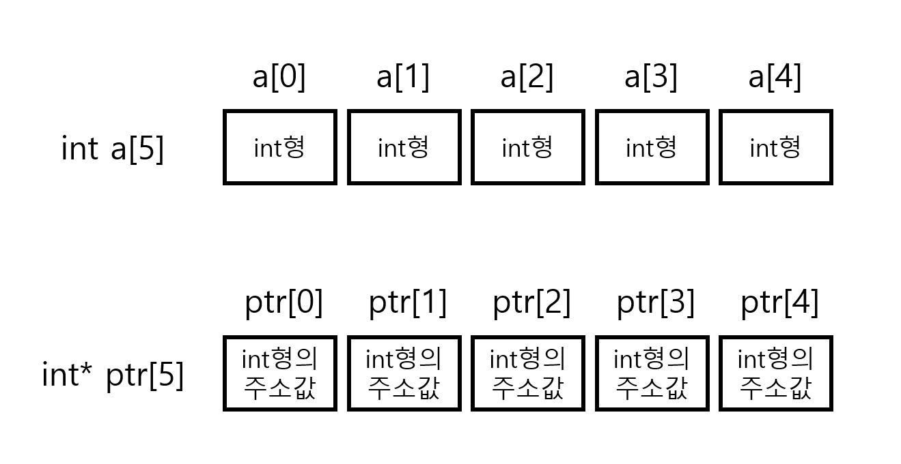

# 포인터 배열과 배열 포인터

이전 내용에서 배열을 포인터 변수로 저장할 때, **해당 배열의 첫 원소의 주소값**을 저장하는 것에 대해서만 알아보았다.
이 경우, int 배열이면 4바이트의 주소값 하나만 저장하는 셈이다.
그래서 이번엔 배열 전체의 주소를 다루는 포인터 배열과 배열 포인터에 대해서 복습하고자 한다.

## 포인터 배열

포인터 베열은, **포인터를 원소로 가지는 배열**을 말한다.
간단히 말하면,
``` C++
int a[5] = {1,2,3,4,5};
```
상단 배열 a는 int형으로 이루어진 배열이다.
저번에 배웠던 대로 이 배열을 포인터로 넣으면,
``` C++
int *ptr = a;
// == int *ptr = &a[0];
```
이렇게 첫 번째 원소의 주소값만 저장했었다.

하지만, **포인터 배열**은 조금 다르다.
``` C++
int a,b,c,d,e;
int *ptr[5] = {&a, &b, &c, &d, &e};
```
해당 내용처럼, 포인터 배열은 **주소값을 원소로 쓰는 배열**이라는 것이다.
그러므로, 상단 코드의 경우 int포인터(int*)를, 곧 int형 변수의 주소값을 원소로 할당 가능한 배열로 보면 되겠다.



호출 방식은 다음과 같다.
``` C++
cout << "ptr[0] : " << ptr[0] << endl; //a의 주소값
cout << "ptr[1] : " << ptr[1] << endl; //b의 주소값
cout << "ptr[2] : " << ptr[2] << endl; //c의 주소값

cout << "*ptr[0] : " << *ptr[0] << endl; //a의 값
cout << "*ptr[1] : " << *ptr[1] << endl; //b의 값
cout << "*ptr[2] : " << *ptr[2] << endl; //c의 값
```

## 배열 포인터

배열 포인터는 조금 다른데, 포인터를 원소로 가지는 배열이 아닌, 배열 전체를 가리키는 포인터를 말한다.

``` C++
int arr[3] = {10,20,30};
int (*ptr)[3] = &arr;
```
초기화 방법도 일반 포인터에 첫 번째 원소를 할당할 때나 포인터 배열의 각 원소마다 주소값을 할당해 준 것과 다르게 **&배열이름**을 사용해서 초기화를 해 주었다.
그 말인 즉슨, 배열 전체를 가리키는 포인터라고 보면 된다.

호출 방식은 다음과 같다.
``` C++
cout << "ptr[0] : " << ptr[0] << endl; //arr[0]의 주소값
cout << "ptr[1] : " << ptr[1] << endl; //arr[1]의 주소값
cout << "ptr[2] : " << ptr[2] << endl; //arr[2]의 주소값

cout << "(*ptr)[0] : " << (*ptr)[0] << endl; //arr[0]의 값
cout << "(*ptr)[1] : " << (*ptr)[1] << endl; //arr[1]의 값
cout << "(*ptr)[2] : " << (*ptr)[2] << endl; //arr[2]의 값
```

## 두 포인터의 차이점

``` C++
#include <iostream>

int main()
{
	int x = 1, y = 2, z = 3;
	int* ptrArray[3] = { &x, &y, &z }; //포인터 배열

	int arr[3] = { 10, 20, 30 };
	int (*ptr)[3] = &arr;	//배열 포인터

    //포인터 배열 접근
	std::cout << "*ptrArray[0] : " << *ptrArray[0] << std::endl;
	std::cout << "*ptrArray[1] : " << *ptrArray[1] << std::endl;
	std::cout << "*ptrArray[2] : " << *ptrArray[2] << std::endl;

    //배열 포인터 접근
	std::cout << "(*ptr)[0] : " << (*ptr)[0] << std::endl;
	std::cout << "(*ptr)[1] : " << (*ptr)[1] << std::endl;
	std::cout << "(*ptr)[2] : " << (*ptr)[2] << std::endl;
}
```
단일 변수의 주소를 가리켜 배열로 저장하는 것은 **포인터 배열**,

배열 전체의 주소를 가리켜 저장하는 배열은 **배열 포인터**다.

이 중에 배열 포인터는 주로 다차원 배열을 제어할 때 사용한다고 하는데, 나중에 구현할 때 찾아볼 수 있도록 작성해두었다.

끝!