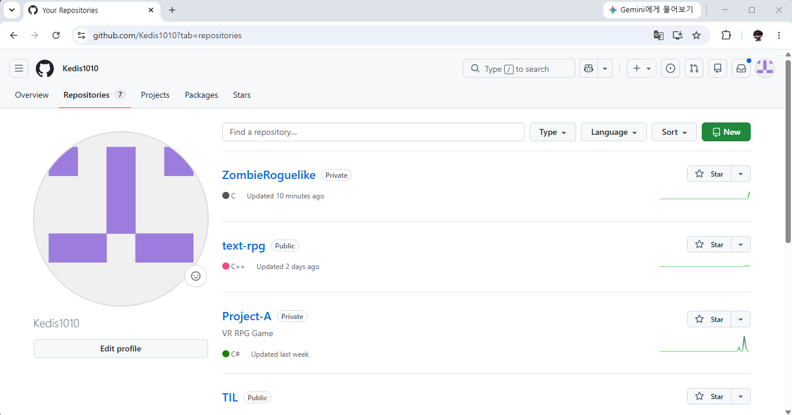
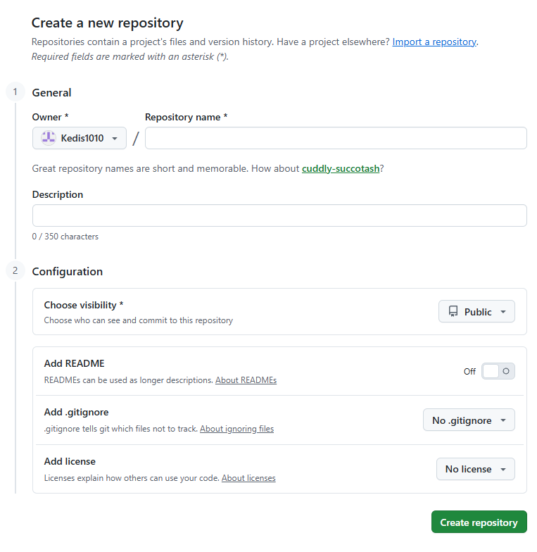
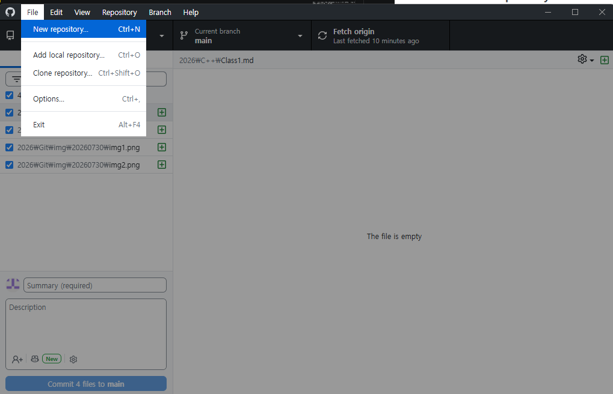
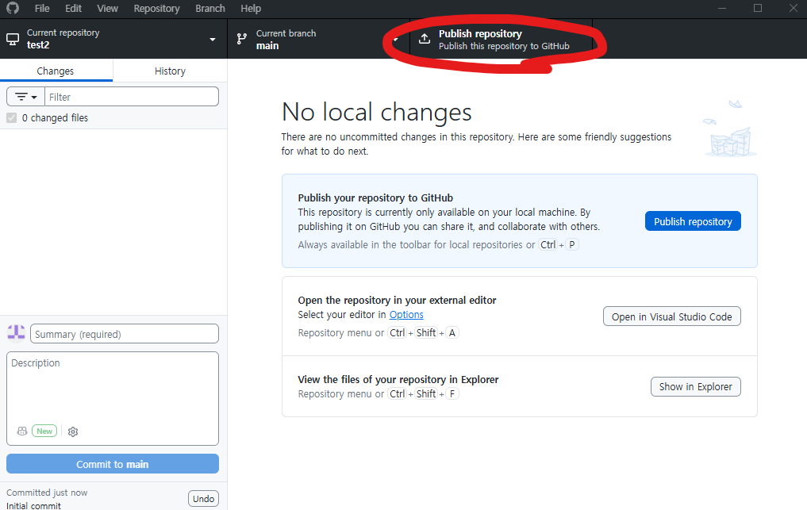
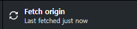
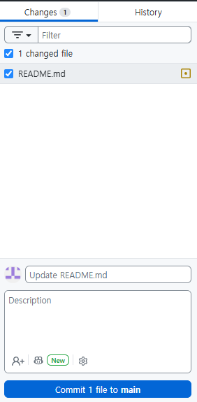
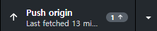
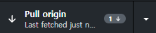

# 깃허브 데스크탑 사용법
## 1. 개요
개발을 하면서 생기는 사고를 막기 위한 백업 준비, 혹은 협업에 굉장히 유용한 Git

이 Git을 터미널이 아닌 소프트웨어로서 편리하게 사용할 수 있개 해주는 Github desktop과 Github의 사용법에 대해서 기록해두고자 한다.

## 2. 레포지토리 생성

**깃허브 홈페이지에서 레포지토리를 생성할 수도 있고, 깃허브 데스크탑에서도 레포지토리를 생성할 수 있다.
홈페이지에서는 기본적으로 초록색 New 버튼을 눌러 레포지토리를 생성할 수 있다.**

레포지토리를 생성할 때는 다음 항목들을 설정할 수 있다 :
- 레포지토리 이름
- 레포지토리 설명
- 공개 범위
- README 마크다운 파일
- 깃이그노어
- 라이센스 페이지

깃허브 데스크탑에도 File-New repository를 통해 동일한 방법으로 생성이 가능하지만, Publish repository를 눌러 GitHub에 업로드 해주는 과정 하나가 더 필요해진다.

레포지토리를 생성한 이후에는, 협업자들을 링크 공유로 초대하거나 관리자 추가 탭에서 수동적으로 초대할 수 있다.

## 3. Fetch, Commit, Push , Pull

### - Fetch

Fetch는 새로고침의 개념이라고 보면 된다. Github Desktop에서 GitHub홈페이지로부터 업데이트 된 내용을 받아오기 위해서는 Fetch origin버튼을 눌러 갱신을 해 주어야 한다.

변경사항이 있다면 갱신 후 표시된다.

### - Commit

Commit은 **변경사항이 있을 때, 이를 로컬에 저장하는 행위**를 말한다.
~~게임에서의 세이브포인트와 비슷하다고 보면 될듯~~
변경사항이 있을 때만 Commit이 가능하며, Commit은 작업한 Branch에서 로컬로 저장된다. 
변경 내용은 Changes에서 확인 가능하기에 어떤 점이 추가, 수정, 삭제되었는지 직관적으로 확인할 수 있다.

Commit을 할 때 커밋 요약과 설명을 작성할 수 있는데, 어떤 점이 수정되었는지 잘 알 수 있게 작성해 두는 것이 좋다.

### - Push

Push는 Commit 이후에 할 수 있는 행동이며, Commit으로 저장된 변경사항을 로컬에서 Github 레포지토리의 해당 Branch로 업데이트 해준다.
Commit이 로컬에 저장이면, Push는 실질적 업로드를 의미한다고 보면 되겠다.
선택한 레포지토리의 선택한 브랜치에 바로 적용시키는 것이기 때문에, 협업 중에 main 등에 push를 하는 행동은 위험한 행동이다.

### - Pull

